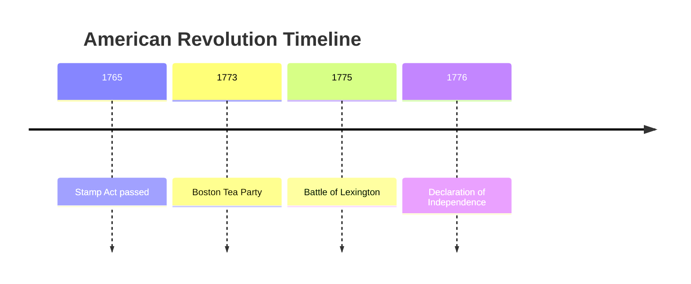

# Visual Aids Implementation for CozmicLearning

## Overview

This document explains the new visual aids system for assignments and lessons, addressing the issue where questions reference visuals that don't exist.

## The Problem

1. **Assignment Questions**: Questions are generated that reference diagrams/visuals, but no actual visual is provided to students
2. **Student Lessons**: Lessons are text-only and difficult to understand for visual learners

## The Solution

### Three Types of Visual Aids

We've implemented an AI-powered visual generation system with three types of visuals:

#### 1. ASCII Art Diagrams
- **Best for**: Math problems, geometry, simple graphs, coordinates, tables
- **Advantages**: No external dependencies, renders in any browser, stores as plain text
- **Example**:
```
Right Triangle ABC:
        C
        |\\
        | \\
     6  |  \\  10
        |   \\
        |    \\
        |_____\\
        A   8   B

Angle C = 90°
```

#### 2. Mermaid.js Diagrams
- **Best for**: Flowcharts, timelines, process diagrams, organizational charts, sequences
- **Advantages**: Beautiful, professional-looking diagrams, interactive, stores as compact code
- **Example**:


#### 3. Visual Descriptions
- **Best for**: Complex scenes that can't be easily diagrammed
- **Advantages**: Helps students mentally visualize concepts
- **Example**: "Picture a large cell like a tiny factory. The nucleus sits in the center like a control room with DNA blueprints. The mitochondria float around like little power plants, creating energy for the cell to use."

## Database Changes

### New Fields in `AssignedQuestion` Model

Three new columns added:
- `visual_type` (TEXT): "ascii", "mermaid", "description", or "none"
- `visual_content` (TEXT): The actual visual content (diagram code or description)
- `visual_caption` (TEXT): Brief title/caption for the visual

### Migrations Created

- **Local (SQLite)**: `migrations/add_visual_fields_sqlite.py` ✅ Already run
- **Production (PostgreSQL)**: `migrations/add_visual_fields_postgres.py`

## New Module: `visual_generator.py`

Located at `/modules/visual_generator.py`

### Key Functions

1. **`should_include_visual(question_text, topic)`**
   - Determines if a question would benefit from a visual
   - Returns True for math, science, geography, timelines, etc.

2. **`detect_visual_type(content, subject)`**
   - Analyzes content to determine best visual type
   - Returns "ascii", "mermaid", "description", or "none"

3. **`generate_ascii_visual(prompt, context)`**
   - Creates ASCII art diagrams using AI
   - Perfect for math problems and simple shapes

4. **`generate_mermaid_diagram(prompt, context)`**
   - Creates Mermaid.js diagram code
   - Great for processes, timelines, flowcharts

5. **`generate_visual_description(prompt, context)`**
   - Creates vivid descriptions for mental visualization
   - Useful for complex concepts

6. **`add_visual_to_question(question_text, topic, subject, grade)`**
   - Main function that automatically adds appropriate visual
   - Returns dict with visual_type, visual_content, visual_caption

7. **`add_visual_to_lesson(lesson_data, subject, grade)`**
   - Adds visuals to lesson content where appropriate
   - Modifies lesson dict in place

## Next Steps for Implementation

### For Assignment Questions

You need to update `modules/teacher_tools.py` in the `assign_questions()` function:

```python
from modules.visual_generator import add_visual_to_question

# After generating a question:
visual_data = add_visual_to_question(
    question_text=q["prompt"],
    topic=topic,
    subject=subject,
    grade=grade
)

# Add visual fields to question dict:
q["visual_type"] = visual_data["visual_type"]
q["visual_content"] = visual_data["visual_content"]
q["visual_caption"] = visual_data["visual_caption"]
```

### For Student Lessons

Update `modules/student_lessons.py` in the `generate_student_lesson()` function:

```python
from modules.visual_generator import add_visual_to_lesson

# After generating lesson JSON:
lesson_data = add_visual_to_lesson(
    lesson_data=lesson_dict,
    subject=subject,
    grade=grade
)
```

### Frontend Display

#### For Mermaid Diagrams

Add this to your HTML templates (one time, in base template):

```html
<!-- In <head> -->
<script src="https://cdn.jsdelivr.net/npm/mermaid@10/dist/mermaid.min.js"></script>
<script>
  mermaid.initialize({ startOnLoad: true, theme: 'dark' });
</script>
```

Then display Mermaid diagrams like this:

```html

<div class="visual-container">
  <p class="visual-caption">{{ question.visual_caption }}</p>
  <div class="mermaid">
    {{ question.visual_content | safe }}
  </div>
</div>

```

#### For ASCII Diagrams

```html

<div class="visual-container">
  <p class="visual-caption">{{ question.visual_caption }}</p>
  <pre class="ascii-diagram">{{ question.visual_content }}</pre>
</div>

```

#### For Visual Descriptions

```html

<div class="visual-container">
  <p class="visual-caption">{{ question.visual_caption }}</p>
  <p class="visual-description">{{ question.visual_content }}</p>
</div>

```

## CSS Recommendations

```css
.visual-container {
    background: rgba(79, 172, 254, 0.1);
    border: 1px solid rgba(79, 172, 254, 0.3);
    border-radius: 12px;
    padding: 20px;
    margin: 20px 0;
}

.visual-caption {
    font-weight: 600;
    color: #4facfe;
    margin-bottom: 10px;
}

.ascii-diagram {
    font-family: 'Courier New', monospace;
    background: rgba(0, 0, 0, 0.3);
    padding: 15px;
    border-radius: 8px;
    overflow-x: auto;
    color: #fff;
    line-height: 1.4;
}

.visual-description {
    font-style: italic;
    color: #e0e0e0;
    line-height: 1.6;
}
```

## Benefits

1. **Better Learning**: Visual learners can see diagrams and charts
2. **Clearer Questions**: Math and science problems are easier to understand
3. **No Image Hosting**: Everything stores as text in the database
4. **Free**: Uses AI to generate visuals, no image generation API costs
5. **Professional**: Mermaid diagrams look polished and modern
6. **Accessible**: ASCII art works everywhere, no JavaScript required

## Example Use Cases

### Math Problem
```
Question: "Find the area of the triangle shown above"
Visual Type: ascii
Visual Content: [ASCII art of triangle with labeled sides]
```

### History Lesson
```
Topic: "American Revolution Timeline"
Visual Type: mermaid
Visual Content: [Mermaid timeline code]
```

### Science Concept
```
Topic: "Cell Structure"
Visual Type: description
Visual Content: "Picture a large cell like a tiny factory..."
```

## Performance Impact

- **ASCII generation**: ~0.3-0.5 seconds per question
- **Mermaid generation**: ~0.4-0.6 seconds per question
- **Description generation**: ~0.2-0.4 seconds per question
- **Total cost**: ~$0.0001 per visual (using gpt-4o-mini)

Very minimal impact - worth it for the educational value!

## Gradual Rollout Recommendation

1. **Phase 1** (Now): Deploy database changes and visual generator module
2. **Phase 2**: Add visuals to new assignment questions only
3. **Phase 3**: Add visuals to student lessons
4. **Phase 4** (Optional): Backfill existing questions with visuals using a script

This way you can test and refine before rolling out everywhere.
